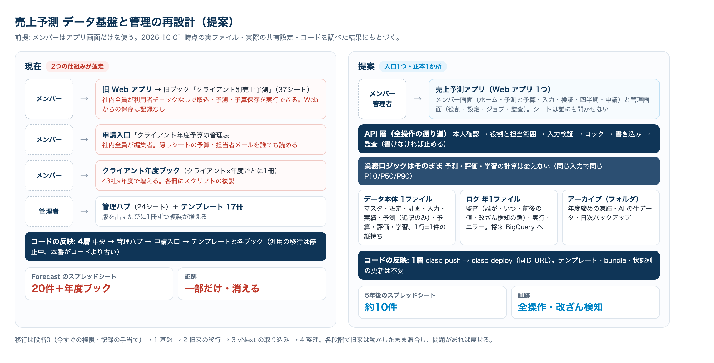

# 売上予測 データ基盤と管理の再設計（提案）

状態: **承認済み（2026-10-01）**。段階0・段階1は完了。段階2は取り込み・計算の一致・新アプリでの予測の実行まで完了（2026-10-02）、2-3 に着手。
作成: 2026-10-01 Claude Code（Mac mini）
前提（2026-10-01 ユーザー方針）: **メンバーにはアプリ画面だけを使ってもらう**。裏側は最も適切なデータの持ち方にし、シートファイルを乱立させない。ログ・監査・拡張性・柔軟性・保守性も考慮する。
根拠: このリポジトリのコードと文書、および Drive 上の実ファイルのメタデータ（名前・置き場所・共有設定のみ。中身は読んでいない）を 2026-10-01 に調べた結果。

## 0. 結論

1. **入口は1つの Web アプリにする。** アプリは「システムの権限」で動かし、メンバーはどのスプレッドシートにも権限を持たない。誰が何をできるかはアプリが役割表で判定する。
2. **裏側の正本は「データ本体」1ファイルと「ログ」年1ファイルに集約する。** クライアントごと・年度ごと・テンプレートの版ごと・申請ごとにファイルを作るのをやめる。
3. **テーブルは「1行=1件の縦持ち・キーと型を固定・値だけ」に作り直す。** 表示はアプリが組み立てる。予測・評価・学習の計算ロジックは変えず、読み書きの層だけを差し替える。
4. **書き込みはすべてアプリの API を通し、監査記録が書けなければ処理を止める。** 誰が・いつ・何を・変更前後の値を残し、改ざんに気づけるようにハッシュの鎖を付ける。
5. **当面はスプレッドシートで追加費用なし。** ログ量や分析の需要が目安を超えたら、ログだけ BigQuery へ移す。そのための保存先の差し替え層を最初から用意する。

## 1. 現状の診断（2026-10-01 時点の事実）

### 1-1. 2つの仕組みが並んで動いている

| | 旧来の仕組み（Legacy） | vNext |
|---|---|---|
| ファイル | 「クライアント別売上予測」1冊（マイドライブ） | 管理ハブ・テンプレート・クライアント年度ブック・申請入口（共有ドライブ「年度予算策定」） |
| 単位 | 1クライアント=1冊（CONFIG!B2 で対象を決める） | 1クライアント×1年度=1冊 |
| 画面 | Web アプリ（A-2〜C-3・B-5 自動学習・空模様） | 各ブックのサイドバー、申請入口の Web アプリ |
| 機能の偏り | B-5 自動学習はここだけ（vNext へは移植しない方針） | 承認・公式版・申請はここだけ |

同じ「売上予測」の機能が2つの仕組みに分かれていて、どちらか一方だけでは業務が完結しない。

### 1-2. ファイルが増え続ける作り

- **Forecast の仕組みのスプレッドシートは20件。そのうち17件がテンプレート**（版を出すたびに1冊ずつ複製したものと、作成に失敗したもの）。
  - 共有ドライブ「04_テンプレート」: 現行4件・履歴12件。マイドライブ: `[SETUP FAILED]` 1件。
- クライアント年度ブックは設計上、クライアント×年度ごとに1冊ずつ増える（ZAC 候補43社 × 年度）。現在フォルダ「02_クライアント年度ブック/FY2026」は0件。資料に載っているライブ UAT のブック（アストラゼネカ FY2027）は、このアカウントの Drive API からは見つからない（削除・移動・権限のいずれかで、未確認）。
- 同名フォルダの重複（「03_管理者」×2、「04_テンプレート」×2）と、マイドライブの作業残り（「Forecast vNext Private …」フォルダ）がある。

### 1-3. コードの届け方が4層

中央 project → 管理ハブ（21ファイル完全一致の複製）→ 申請入口の bundle → クライアントの bundle（テンプレートとモデルの pair、状態別の同一 URL 更新）。

- 文書が「中央source、Hub bound project、ACTIVE pair、対象Client pinの4層を確認」と書く（AI_HANDOFF.md:130）。
- 既存の年度ブックへの汎用の移行は停止中で、状態ごとの専用の更新関数しかない。
- 本番がコードより古いまま（クライアント 1.7.0 / コード 1.8.0、申請入口 1.7.27 / コード 1.7.40）。
- 2026-10-01 には、リポジトリ内に作られた作業用ワークツリーのファイルまで push 対象に入り、21 ファイルが 66 ファイルになりかけた（`.claspignore` で修正済み）。

### 1-4. データの持ち方の問題（旧来の仕組み・37シート）

| 問題 | 例 |
|---|---|
| 表示と保存が混ざっている | CONFIG は入力・調整値・表示用の定数・説明文が同じ A:B 列。OUTPUT はレポート・予算入力・数式・グラフが同居し、アプリは見出しの文字を手がかりに読み戻している |
| 上書きで消える | A-1 はログを含む全シートを消す。A-9 は予算入力（H・I 列）を消す。取込は毎回全消しして書き直す |
| ID がつながらない | 予測の snapshot_id、実行ログの run_id、学習履歴の run_id がそれぞれ別の UUID |
| 型の事故 | 'yyyy/MM' が日付に自動変換され、評価の結合が全部外れた（EVAL_LOG が空）。追記ログに重複排除がなく件数が水増しされた |
| 横持ち | SALES_MONTHLY は48か月を列に並べている |
| 業務ルールの数値が散在 | 年間10%・半期12%・過大5%、自動学習の各値はコードに直書き。調整値は CONFIG とコードに二重管理 |
| 使われていないシート | AI_RESEARCH_RAW / AI_RESEARCH_TASK_LOG / DLM_STATE / BACKTEST_REPORT / LANDING_FORECAST は誰も読まない |
| 同時実行の制御がない | LockService を使っていない。2人が同時に保存すると後勝ちで消える |

### 1-5. ログ・監査の穴

- **旧来の仕組み:**
  - Web からの保存（入力・予算・インサイト・四半期の承認・初期設定）は一切記録されない。手でのセル修正も記録されない。
  - RUN_LOG の項目が名前どおりでない（parameters_snapshot_json は一部だけ、input_data_hash は入力のハッシュではない、所要時間が0）。
  - 四半期レビューの「承認者」は C-2 を実行した人で、判断を入力した人ではない。
- **vNext:**
  - ADMIN_AUDIT_LOG（約55種）はあるが、変更前後の値は1種だけで、書き込みに失敗しても握りつぶす。
  - 表は上書きで更新し、変更の履歴が残らない。保存期間の決まりがなく、UAT リセットで監査も消える。
- **共通:** アプリは「デプロイした人」の権限で動くため、スプレッドシートの版の履歴に残るのはその1人だけ。**アプリ側の記録が唯一の証跡になる。**

### 1-6. 権限の穴

| 対象 | 状態 |
|---|---|
| 旧来の Web アプリ | 社内ドメイン全員が開け、利用者のチェックなしに、デプロイした人の権限で A-2〜C-3（取込・予測実行・予算保存・四半期の適用）を実行できる |
| 申請入口（「クライアント年度予算の管理表」） | **実物で社内ドメイン全員が編集者**。隠しシートの PORTAL_DIRECTORY にクライアント別の P50・採用予測・最終予算・担当者メールが入っており、社内の誰でも読める |
| クライアント年度ブック | 申請入口から作ると社内ドメイン全員が編集可。内部シートは警告だけの保護 |
| 管理ハブ | 実物では共有ドライブの管理者1名だけ（問題なし）。ただし、ドメイン全体に共有ドライブの権限を付けるコードが残っている |

## 2. 目標と設計原則

**目標:** メンバーはアプリだけを使う。正本は1か所にまとめる。すべての変更を追える。後から機能や指標を足しやすくする。運用の手数とファイル数を最小にする。

| # | 原則 |
|---|---|
| P1 | 入口は1つ（Web アプリ）。メンバーにシートを開かせない |
| P2 | 正本は1か所（データ本体）。ファイルを作る単位は「年」まで（クライアント・版・申請ごとには作らない） |
| P3 | 1行=1件の縦持ち。キーと型を固定し、値だけを置く（数式・タイトル・説明・装飾を置かない）。表示はアプリが組み立てる |
| P4 | 確定したものは上書きしない。予測結果・公式版は追記のみで、訂正は新しい版を足す（既存方針の継続） |
| P5 | 書き込みは必ず API を通し、権限確認 → 入力検証 → ロック → 書き込み → 監査記録を1か所で行う。監査が書けなければ止める |
| P6 | 業務の数値は設定表に置き、効く日付と変更者を残す。コードには既定値と範囲チェックだけを持つ |
| P7 | 保存先は差し替え可能な層で包む（シートから BigQuery などへ移すときに業務ロジックを触らない） |
| P8 | 計算ロジック（予測・評価・学習）は変えない。移行の受入基準は「同じ入力で同じ P10/P50/P90」 |

## 3. 全体像（提案）



```
メンバー（社内ドメイン）              管理者
        │                               │
        ▼                               ▼
┌──────────────── 売上予測アプリ（Web アプリ 1つ）───────────────┐
│ メンバー画面: ホーム／予測と予算／入力／検証／四半期／申請      │
│ 管理画面:     メンバーと役割／クライアント／設定／ジョブ／監査   │
├──────────────── API 層（全操作の通り道）────────────────────────┤
│ 本人確認 → 役割と担当範囲の判定 → 入力検証 → ロック → 書き込み → 監査 │
├──────────────── 業務ロジック（既存の予測・評価・学習をそのまま）──┤
├──────────────── 保存先の差し替え層（表の定義・読み書き・キャッシュ）┤
└──────┬───────────────────────┬───────────────────────┬──────┘
       ▼                       ▼                       ▼
 データ本体（1ファイル）   ログ（年1ファイル）     アーカイブ（フォルダ）
 マスタ・設定・計画・入力   監査・実行・エラー       年度締めの凍結・AI の生データ
 実績・予測・予算・評価・学習  （将来 BigQuery へ）     ・日次バックアップ
       ▲
 定期処理（時間トリガー＋ジョブ表）: 実績取込・AI 調査・健康診断・バックアップ
 外部: 売上実績のスプレッドシート（読み取り）、Vertex AI
```

- **アプリ:** 独立した Apps Script プロジェクト（スタンドアロン）で、実行はシステム（デプロイした人）、アクセスは社内ドメイン。既存の画面（ホーム・予測と予算・入力・検証・四半期・空模様のキャラ）を引き継ぎ、vNext の承認・公式版・申請の画面を同じアプリに足す。
- **データ本体:** システムのアカウントだけが編集でき、管理者は閲覧のみ。メンバーには共有しない。
- **ログ:** 年度ごとに1ファイル（例「売上予測 ログ FY2026」）。年度は4月始まりで、始まりの年で呼ぶ（旧来の計算・vNext と同じ。FY2026 = 2026/04〜2027/03）。
- **アーカイブ:** 年度を締めるときに、その年度の確定データを凍結して移す。AI の生データ（プロンプトと応答）は JSON ファイルで置き、表には参照だけを持つ。

**ファイル数の比較**

| | 現在 | 提案（5年運用後の例） |
|---|---|---|
| スプレッドシート | 20件（テンプレート17・旧ブック・管理ハブ・申請入口）＋ 年度ブック（43社×年度で増える） | データ本体1 ＋ ログ5（年1）＋ 年度アーカイブ4（締めた年1） = 約10 |
| Apps Script | 中央・管理ハブ・申請入口・テンプレート17・年度ブック（それぞれに bound script） | アプリ1 |
| コードの反映 | 4層（中央→管理ハブ→申請入口→テンプレートと各ブック） | 1層（clasp push → clasp deploy、同じ URL） |

## 4. データの持ち方

### 4-1. 共通ルール

- 1テーブル=1シート。1行目は固定の英字の列名、2行目からデータ。数式・タイトル・説明・色は置かない（説明はこの文書と管理画面に置く）。
- **ID は接頭辞付きの文字列**: `CL-`（クライアント）、`PL-`（計画=クライアント×年度）、`RUN-`（予測実行）、`OFF-`（公式版）など。時刻順に並ぶ ID にする。
- **月は 'yyyy-MM' の文字列**（列は書式「書式なしテキスト」）、時刻は JST の ISO 8601 文字列。日付への自動変換の事故をなくす。
- 金額は円の整数、率は小数。
- 編集できる表は `created_at, created_by, updated_at, updated_by, row_version` を必ず持つ。削除は `is_deleted` による論理削除。
- 可変の詳細は JSON 列に入れてよい（セルの上限5万字に対し、4万字までに抑える）。それを超えるものは Drive の JSON に置き、表には参照を持つ。
- 表の定義（列・型・必須・キー）はコードの1か所（スキーマ登録）に置き、データ本体の `_SCHEMA` 表に版を記録する。列が定義と違えば書き込まずに止める（vNext Core の方式を全表に広げる）。

### 4-2. データ本体のテーブル

| グループ | テーブル | 1行の単位 | 主な列 |
|---|---|---|---|
| マスタ | CLIENTS | クライアント | client_id, client_name, zac_code, normalized_name, aliases_json, is_active |
| | MEMBERS | 社員 | email, display_name, department, is_active（社員名簿とメールの対応表が無かった問題を解消） |
| | ROLES | 権限の付与 | email, role, scope_type(ALL/CLIENT), client_id, valid_from, valid_to, granted_by |
| 設定 | SETTINGS | 設定値 | key, value, value_type, scope(GLOBAL/CLIENT/PLAN), scope_id, effective_from, note |
| 計画 | PLANS | クライアント×年度 | plan_id, client_id, fy, state, owner_email, current_run_id, current_official_id |
| | PLAN_EVENTS | 状態の変化 | plan_id, from_state, to_state, actor_email, actor_role, reason, occurred_at |
| | REQUESTS | 申請 | request_id, request_type, client_id, fy, requested_by, status, payload_json |
| | APPROVALS | 承認依頼 | approval_id, plan_id, run_id, budget_version_id, status, decided_by, decision_comment |
| | OFFICIAL_RECORDS | 公式版（追記のみ） | official_id, plan_id, run_id, budget_version_id, snapshot_hash, supersedes_official_id, issued_by |
| 入力 | INPUTS | 入力1件 | input_id, plan_id, kind(PRODUCT/CLIENT/OPINION/SPOT), person_email, ym, step_rate, amount, confidence, product, project, reason, is_deleted |
| 実績 | SALES_MONTHLY | クライアント×月×区分 | client_id, ym, service_type, amount, import_batch_id |
| | ACTUALS_MONTHLY | 検証用実績 | client_id, ym, service_type, amount, closed, import_batch_id |
| | IMPORT_BATCHES | 取込1回 | import_batch_id, source, rows, content_hash, started_at, finished_at, actor_email |
| 予測（追記のみ） | FORECAST_RUNS | 予測1回 | run_id, plan_id, engine_version, settings_hash, input_hash, seed, status, annual_p10/p50/p90, started_at, finished_at, actor_email |
| | FORECAST_MONTHLY | 実行×月×シナリオ | run_id, ym, scenario, p10, p50, p90, base, spot |
| 予算 | BUDGET_VERSIONS | 予算の版 | budget_version_id, plan_id, run_id, status(DRAFT/SUBMITTED/APPROVED), submitted_by |
| | BUDGET_MONTHLY | 版×月 | budget_version_id, ym, adopted_forecast, sales_uplift, final_budget |
| 評価 | EVAL_MONTHLY | 計画×月 | plan_id, ym, run_id, actual, p10, p50, p90, ape, signed_error, over_flag, range_outside_flag, policy_version |
| | EVAL_SUMMARY | 計画×期間×指標 | plan_id, period(ANNUAL/H1/H2), metric, value, pass |
| | INSIGHTS | 原因の記録 | insight_id, plan_id, ym, 自動の列（insight, next_action）, 人の列（hypothesis, action_type, owner_email, status） |
| | REVIEW_PROPOSALS | 四半期の提案と判断 | proposal_id, plan_id, quarter, target_field, current_value, proposed_value, decision, decided_by（判断した本人） |
| 学習 | CALIBRATION_STATE / CALIBRATION_HISTORY | クライアントの補正値 / その変更 | 現行の列を client_id で保持 |
| | SOURCE_RELIABILITY / RELIABILITY_EVIDENCE / POOL_PRIOR | 情報源の信頼度・横断の事前分布 | 現行の列を client_id で保持（1か所にあるので、他ブックを開いて集める処理が不要になる） |
| | LEARNING_HISTORY | 実行ごとの AI・主観の効き | run_id, kind(AI_SCORE/AI_IMPACT/SUBJECTIVE), ym, key, value_json |
| AI | AI_RUNS / AI_ITEMS | AI 調査1回 / 構造化した結果 | ai_run_id, client_id, model, status, tokens, raw_ref（Drive の JSON） / item の各列 |
| 運用 | JOBS | 非同期ジョブ | job_id, job_type, target_id, idempotency_key, status, attempts, locked_at, result_json, error（vNext の JOB_QUEUE を継承） |
| | _SCHEMA | 表の版 | table, schema_version, migrated_at |

旧来と vNext の各シートとの対応は付録A。

**例: 予測を1回実行すると**
1. FORECAST_RUNS に1行を足す（設定と入力のハッシュ、エンジンの版、実行者）。
2. FORECAST_MONTHLY に月×シナリオの行を足す。どちらも上書きしない。
3. PLANS.current_run_id を更新し、監査ログに「FORECAST.RUN」を1行残す。
4. 予算は BUDGET_* に別に持つので、予測を再実行しても入力済みの予算は消えない。

## 5. ログと監査

### 5-1. 3種類のログ（ログのファイルに置く。月ごとに1シート）

| ログ | 内容 | 主な列 |
|---|---|---|
| 監査ログ AUDIT_YYYY_MM | すべての書き込み、拒否された操作、出力（ダウンロード）、管理画面の操作 | audit_id, occurred_at, actor_email, actor_roles, action, entity_type, entity_id, client_id, plan_id, before_json, after_json, reason, request_id, app_version, result(OK/DENIED/FAILED), prev_hash, row_hash |
| 実行ログ RUN_YYYY_MM | 関数とジョブの実行 | run_id, request_id, kind, started_at, finished_at, duration_ms, status, input_hash, output_ref, error |
| エラーログ ERROR_YYYY_MM | 例外 | error_id, request_id, where, message, stack_head, occurred_at |

- **request_id で3つと業務の表（FORECAST_RUNS など）をつなぐ。** 旧来の「ID がつながらない」問題を解消する。
- **監査が書けなければ処理を止める**（vNext のように握りつぶさない）。
- **改ざんに気づける:** 各行の row_hash を「前の行の hash＋この行の内容」の SHA-256 にする。毎日の健康診断で鎖を検証し、最新の hash を Script Properties にも控える。行を消したり書き換えたりすれば鎖が切れて検知できる。
- **閲覧の記録:** 既定では残さない（量が多いため）。必要なら設定で「誰がどの計画を見たか」も残せるようにする。
- **見られる人:** 管理者だけ。管理画面で絞り込み・CSV 出力ができる。
- **保存期間:** 年度ファイルは締めた後に読み取り専用にして残す。何年残すかは要決定（11章）。

### 5-2. 記録する操作の例

PLAN.CREATE / INPUT.CREATE・UPDATE・DELETE / IMPORT.SALES・ACTUALS / FORECAST.RUN / BUDGET.SAVE / PLAN.SUBMIT・APPROVE・RETURN / OFFICIAL.ISSUE・AMEND / INSIGHT.UPDATE / REVIEW.DECIDE・APPLY / SETTING.UPDATE / ROLE.GRANT・REVOKE / CLIENT.UPDATE / EXPORT / JOB.RETRY / ACCESS.DENIED

## 6. 権限とセキュリティ

- **アプリはシステムの権限で動く。** できればシステム用アカウントでデプロイし、データとログもそのアカウントが持つ（担当者の異動でも止まらない）。メンバーにはどのファイルも共有しない。
- **本人の特定:** 社内ドメインのアクセス制限の下で `Session.getActiveUser().getEmail()` を使う。取れない場合は操作させない（fail-closed）。
- **役割（ROLES）と担当範囲:**

| 役割 | できること | 範囲 |
|---|---|---|
| VIEWER（閲覧） | 計画・予測・評価を見る | 全クライアント（社内全員の既定。2026-08-12 の「閲覧は社内全員」方針） |
| CONTRIBUTOR（情報提供） | 入力（見解・スポット情報など）を足す | 全クライアント または 担当のみ（要決定） |
| PLANNER（予算策定担当） | 予測実行・予算入力・提出・インサイトの記入 | 担当クライアント |
| APPROVER（承認者） | 承認・差戻し・公式版の発行 | 全クライアント または 部門 |
| ADMIN（管理者） | 設定・役割・クライアント・取込・ジョブ・監査ログ・アーカイブ | 全体 |

- **API ごとに役割を判定し、相手に許された範囲のデータだけを返す。** AI の生データ・内部の設定・他クライアントの未公開情報は画面に送らない。
- **ファイル:** データ・ログ・アーカイブはシステムのアカウント（編集）と管理者（閲覧）だけに共有する。社内全員に開いた共有ドライブには置かない。
- **管理者もシートを直接編集しない。** 管理画面から操作して監査に残す。緊急時の直接修正は手順と記録を決めておく。
- 秘密情報とファイル ID は Script Properties に置く（既存規約）。アプリを他サイトに埋め込まないなら、`ALLOWALL` の XFrame 設定はやめる。

## 7. 拡張性・柔軟性

| 足したいもの | やること |
|---|---|
| 入力の種類（例: 競合情報） | INPUTS.kind に値を足し、入力フォームを足す。新しいシートは不要 |
| 指標・天気の判定ルール | SETTINGS に値、コードにルールを足す。過去の評価は policy_version で区別する |
| 新しい画面 | 同じ API を使う。権限と監査は自動的に付く |
| クライアント横断の分析 | 1か所にあるので、そのまま集計できる。将来は BigQuery と Looker Studio |
| 予測エンジンの改良 | FORECAST_RUNS.engine_version で区別する。過去の実行は書き換えない |
| 表の列の追加・変更 | スキーマ登録の版を上げ、移行関数で「試す → 適用 → 検証」。結果は監査に残す |
| 保存先の変更 | 差し替え層の実装を足す（例: ログを BigQuery へ）。業務ロジックはそのまま |

## 8. 保守・運用

- **コードの反映は1層:** `clasp push` → `clasp deploy -i <公開デプロイ ID>`（同じ URL）。アプリの下部と監査ログにアプリの版を出す。テンプレート・bundle・pair・状態別の更新はなくなる。
- **バックアップ:**
  - 毎日、データ本体をアーカイブへ複製する（14世代を残す）。スタンドアロンにすればファイルを複製してもスクリプトは複製されない。
  - 毎月、主要な表を CSV で書き出す。
- **年度の締め:** 確定した年度のデータを「売上予測 アーカイブ FYyyyy」に移して読み取り専用にし、次の年度のログファイルを作る。データ本体は現役の年度だけを持つので重くならない。
- **健康診断（毎日）:** 表の定義との一致、監査の鎖、失敗したジョブ、容量、権限（ファイルが余計な人に共有されていないか）を確かめ、管理画面の「要対応」とメールで知らせる。
- **文書:** 運用手順は README の1か所にまとめる。

## 9. 容量と上限（見積もり）

想定: 現役のクライアント50社まで、利用者100人まで、計画1件あたり年10回の予測実行。

| 表 | 1年あたりの行数（目安） | 備考 |
|---|---|---|
| PLANS / APPROVALS / OFFICIAL_RECORDS | 50〜数百 | |
| INPUTS | 1万前後 | |
| SALES_MONTHLY / ACTUALS_MONTHLY | 1万前後（クライアント×月×区分に集約） | 明細は取込元にあるので持たない |
| FORECAST_MONTHLY | 2万前後（500回×36行） | 年度締めでアーカイブへ |
| EVAL_MONTHLY / INSIGHTS | 1千前後 | |
| 監査ログ | 多めに見て年数万〜25万（月1シートに分ける） | |

- GAS の目安（Chaos2Order の実績）: 1シートが4〜5万行×25列を超えると、まとめて読むと遅くなり、メモリも足りなくなる。データ本体の各表は2万行以下に保つ（年度締めで移す）。
- アプリはシステムのアカウントで動くので、同時実行（1アカウントあたり約30）と1日の実行時間・外部呼び出しの上限はそのアカウントにまとまる。この規模なら足りる。長い処理（AI 調査・一括の再計算）はジョブ表と時間トリガーで分けて実行する。
- **BigQuery へ移す目安:** 監査ログが月5万行を超える、横断の分析を日常的にする、ログファイルの容量が500万セルに近づく。移すのはログから（読み込みジョブは無料、すべての問い合わせに読み取り量の上限を付ける。Chaos2Order の方式）。

## 10. 移行計画

| 段階 | やること | 完了の条件 |
|---|---|---|
| 0 すぐ・小さく | ① 旧 Web アプリに利用者のチェックと操作の記録を足す（実行・保存は担当者と管理者だけ） ② 申請入口の社内全員への編集権限と、隠しシートの予算・メールの扱いを見直す ③ 年度ブックの新規作成とテンプレートの版の発行を止める | 誰でも実行できる状態が解消される |
| 1 基盤 | 新アプリ（スタンドアロン）、データ本体とログの2ファイル、スキーマ登録・差し替え層・権限・監査（鎖つき）・設定・管理画面の土台・バックアップ | 監査の鎖と権限のテストが通る。空の状態から管理者が役割を設定できる |
| 2 旧来の移行 | 旧ブックのデータを移し、A-2〜C-3・B-5・空模様の画面を新しい保存先で動かす | 同じ入力で P10/P50/P90 が一致する（並行運用で照合） |
| 3 vNext の取り込み | 申請・承認・公式版・AI 調査ジョブ・年度の状態管理を新アプリへ。管理ハブのデータ（登録・公式版・承認）を移す | 公式版の snapshot hash が移行前後で一致する |
| 4 整理 | 旧ブック・管理ハブ・テンプレート・年度ブック・申請入口を読み取り専用にしてアーカイブへ（削除はしない）。文書を更新する。必要ならログを BigQuery へ | メンバーの入口が新アプリだけになる |

- 各段階で旧来の仕組みは動かしたまま残し、切り替えるのは照合が済んでから。問題があれば旧来に戻せる。
- 新しいアプリは URL が変わる。切り替えのときに、旧アプリと申請入口の画面へ新しい URL の案内を出す。
- 段階0は今の仕組みへの小さな修正で、段階1以降とは独立して先に行える。

## 11. 決めていただきたいこと

| # | 決めること | 推奨 |
|---|---|---|
| 1 | 旧来と vNext を1つのアプリ＋1つのデータ本体にまとめる方針でよいか | まとめる |
| 2 | 保存先 | スプレッドシート（追加費用なし）で始め、目安を超えたらログだけ BigQuery へ。最初から BigQuery を使う場合は、新しいサービス利用として承認が必要 |
| 3 | アプリを動かし、データを持つアカウント | システム用アカウント（Workspace 管理者による作成が必要）。当面は今のアカウントでも可 |
| 4 | 役割の範囲 | 閲覧は社内全員、情報提供は全員、予測と予算の提出は担当者、承認は管理者（6章の表） |
| 5 | ログの保存期間と、閲覧まで記録するか | 監査は7年保存（社内規程があればそれに従う）。閲覧は記録しない |
| 6 | 段階0（旧 Web アプリの利用者チェック・申請入口の権限の見直し・新規作成の停止）を先に行ってよいか | 先に行う |

## 12. 決定事項（2026-10-01 ユーザー回答）

| # | 決定 |
|---|---|
| 1 | 旧来と vNext を1つのアプリ＋1つのデータ本体にまとめる |
| 2 | スプレッドシートで始め、目安を超えたらログだけ BigQuery へ |
| 3 | アプリを動かしデータを持つのは村井さんのアカウント（システム用アカウントは作らない） |
| 4 | 役割は6章の推奨どおり（閲覧と情報提供は社内全員、予測と予算の提出は担当者、承認は管理者） |
| 5 | 監査ログは7年保存。閲覧は記録しない |
| 6 | 段階0を先に行う。旧 Web アプリは**所有者のみ**にする（178個の公開関数が社内の誰からでも呼べたため。個別に塞ぐ案は取らない）。申請入口は**社内全員の権限を外す** |

### 段階0の進み

| 項目 | 状態 |
|---|---|
| 旧 Web アプリの公開範囲を所有者のみ（`appsscript.json` の `access=MYSELF`） | **本番反映済み（公開 @30、2026-10-01）**。Apps Script API で公開範囲 MYSELF・版 30 の 21 ファイル一致を確認 |
| Web からの書き込み・実行 17 関数の操作の記録（`webAudited_`、ログ用スプレッドシート、ハッシュの鎖、fail-closed） | **本番反映済み（@30）**。ログのファイルは最初の書き込み操作のときに作られる（`tests/forecast-webaudit.test.mjs`） |
| 操作の記録のログの年度を始まりの年で呼ぶ（FY2026 = 2026/04〜2027/03。旧来の計算・新アプリと同じ） | **本番反映済み（公開 @31、2026-10-02）**。それまでに作られたログがあれば、最初の書き込みのときに一度だけキーとファイル名を 1 年ずらす。版 31 の 21 ファイル一致・公開範囲 MYSELF を確認 |
| 申請入口「クライアント年度予算の管理表」の社内全員の編集権限を外す | **完了（2026-10-01、ユーザーが共有設定を変更）**。Drive API で共有が共有ドライブの管理者1名だけになったことを確認 |
| 年度ブックの新規作成・テンプレートの版の発行の停止 | 申請入口を閉じて新しい申請が来ない状態にし、README_VNEXT_JA.md と AI_HANDOFF.md に凍結を明記 |

### 段階1の進み

新アプリは `app/`（[app/README.md](app/README.md)）。ファイル名は画面の表示名に合わせて「売上予測アプリ …」とする（段階0の旧アプリのログ「売上予測 ログ FYyyyy」とは別）。

| 項目 | 状態 |
|---|---|
| スタンドアロンの Apps Script「売上予測アプリ」（`app/`、公開範囲は所有者のみ） | **公開 @1（2026-10-01）**。Apps Script API で公開範囲 MYSELF・実行 USER_DEPLOYING・版 1 の 13 ファイル一致を確認。スクリプトの共有は所有者のみ |
| 初期設定（フォルダ・データ本体・今年度のログ・バックアップ・アーカイブ・表と `_SCHEMA`） | **完了（2026-10-01 19:24、所有者が画面から実行）**。Drive のメタデータで「売上予測アプリ（システム）」1つの中にスプレッドシート2つ（データ本体・ログ。ログは当初「FY2027」と名付け、@4 で「FY2026」に直した）とフォルダ2つ（バックアップ・アーカイブ）だけがあり、どれも共有は所有者のみ・同名の重複なしを確認 |
| 表の定義・保存の層・権限・監査（鎖つき・fail-closed）・設定・バックアップ・管理画面 | 実装済み（0431091）。`app/tests/app-contract.test.mjs` が通る（GAS のモック上。GAS 上の確認は初期設定のときに行う） |
| 空の状態から管理者が役割を設定できる | 画面と API はできている（テストで確認）。実際の付与は、メンバーに使ってもらう段階2の切り替え前に所有者が行う |

### 段階2の実装方針（2026-10-01、旧来のコードの読み書きを洗い出した結果から）

旧来の計算（`Forecast_Agent.js`、約51万字・329関数）を調べた結果、次のことが分かった。

- 計算は 35 の関数がそれぞれ「開いているスプレッドシート」を直接読み書きする作りで、データを引数で渡せない。
- いくつかの結果が、シートの自動変換に依存している。たとえば 'yyyy/MM' の文字列は日付に変わり、数字だけの文字列は数値に変わる。このため、模擬のシートで動かすと結果が変わる。
- 乱数（7か所）と「今日」（締めた月・AI の情報の古さ・既定の年度）で結果が変わり、同じ入力でも毎回同じにはならない。

そこで、次の方針で進める。

1. **計算のコードは1文字も変えない。** 新アプリの中に関数で包んで取り込み、外から呼べないようにする（自動生成。旧来のファイルとの一致をテストで確かめる）。
2. **計算は実物のスプレッドシート「計算用ブック」の上で動かす。**
   - システムのフォルダに1つだけ置いて使い回し、人は触らない。
   - 計算のたびに、データ本体から必要なシートを組み立てて計算し、結果を読み取ってデータ本体へ戻す。
   - 地域と時間帯は旧ブックと同じにする。
3. **計算が使う表は、旧来のシートと同じ列名の表としてデータ本体に持つ**（`ENG_シート名`、1行=1件）。
   - セルの型（数値・文字列・日付・数式）は行ごとに記録する。表示形式は列ごとの並びとして記録する（`ENG_FORMATS`）。こうすると、計算から見て旧ブックと同じ値・同じ自動変換に戻せる。
   - 表の形でないシート（CONFIG・OUTPUT・四半期レビューの画面）と表の外のセルは、行ごとの表（`ENG_ROWS`）に持つ。
   - 計算で読まないシートは移さず、旧ブックに残す。対象は GUIDE・ハブ用・未使用のシートと、AI の生データとその記録。
4. **乱数は実行ごとの種で固定し、「今日」も実行の時刻に固定する。** 種と時刻を記録し、同じ入力から同じ結果を再現できるようにする。
5. **一致は2段で確かめる。**
   - 旧ブックのシートをそのまま写した計算用ブックと、データ本体から組み立てた計算用ブックで、同じ種・同じ時刻で予測を実行する。P10/P50/P90 と書き出された値がすべて一致すること。
   - 旧ブックで過去に実行した結果とは乱数が違うので、差は誤差の範囲で確かめる。
6. **旧来の不具合は、段階2では旧来どおりに再現する（結果を変えない）。**
   - 対象は、自動変換に起因する B-4 の判定、検証インサイトの重複、C-1 の信頼度の集計など。
   - 直すかどうかは、切り替えの後に別に決める。
7. **順番:**
   - 2-1 取り込み（試し→本番）
   - 2-2 新アプリでの予測の実行と一致の確認
   - 2-3 画面（入力・予算・検証・四半期）
   - 2-4 並行運用と切り替え（村井さんの確認の後）

### 段階2の進み

| 項目 | 状態 |
|---|---|
| 2-1 旧ブックの取り込み（所有者だけ）。「試しに読む」は書き込まずに、保存の形から元に戻るか・計算用ブックで組み立て直すと元と同じかを確かめる。「取り込む」は試しと同じ内容のときだけ、計画1つ分を入れ替える（同じ内容なら書かない。書いた後にデータ本体から読み戻して照合する） | **公開 @2（2026-10-01、v0.2.0）**。版 2 の 16 ファイル一致と公開範囲 MYSELF を API で確認。村井さんの「試しに読む」を待つ |
| 2-1 の修正: 時間のかかる処理を裏で動かす（`Jobs.js`） | 初回の「試しに読む」が画面で「ネットワークエラー 503」になった（2026-10-01 22:11。サーバー側は計算用ブックを作りログも書いていたので、1 分を超える通信が途中で切れたとみられる）。試し読み・取り込みを 1 回だけのトリガーで裏で動かし、画面は数秒ごとに状態を尋ねる方式にした（今後の予測の実行も同じ方式）。公開 @3（v0.2.1） |
| 2-1 の確認: 試しに読む（本物の旧ブック） | **全シート一致・「そのまま写せます」（2026-10-01 22:25、村井さんが実行）**。保存の形から元に戻ること、計算用ブックで組み立て直して元の値に戻ることを本物のシートで確認。裏の処理（@3）が GAS 上で動くことも確認 |
| 年度の呼び方の修正 | 新アプリのログを「終わりの年」で名付けていた（FY2027 = 2026/04〜2027/03）。旧来の計算（`getForecastFYStart_`）と vNext（`vNextFiscalYearForDate_`）は「始まりの年」（FY2026 = 2026/04〜2027/03）なので、新アプリも始まりの年にそろえた。既存のログはキーとファイル名を一度だけ直す（`appEnsureFyNaming_`）。公開 @4（v0.2.2） |
| 2-1 の本番の取り込み | **完了（2026-10-01、村井さんが実行）**。データ本体に 12,592 行。書いた後にデータ本体から読み戻して旧ブックと一致 |
| 2-2a 計算の一致の確認（旧ブックの写し ↔ データ本体から組み立て、同じ種・同じ時刻で予測を実行し、計算後の全シートを比べる） | 実装済み（`LegacyEngine.js` = `Forecast_Agent.js` をそのまま包んだもの、`Parity.js`、`app/tests/app-engine.test.mjs`）。公開 @5（v0.3.0）。村井さんの実行を待つ |
| 2-2a の修正: 裏の処理では画面がない | 初回の確認が「予測実行エラー: Cannot call SpreadsheetApp.showNotification() from this context.」で止まった（旧来の計算の途中のトースト。旧アプリの画面から動かすときは黙って無視されていた）。旧来の計算に渡すブックで、トーストを何もしない・表示するシートの切り替えを失敗しても止めない、に差し替えた。公開 @6（v0.3.1） |
| 2-2a の結果（1回目） | **年度合計の P10/P50/P90 は完全に一致**（旧ブックの写し・データ本体から組み立て、同じ種・同じ時刻 2026-10-01 23:19）。全シートの値も一致。違いは DASHBOARD と PROCESS_STATUS の表示形式だけ（値の違う行は 0）。旧ブックの前回の結果との P50 の差は −0.56%（乱数と実行日の違い）。2 段で 266 秒 |
| 表示形式の違いの調べ | 一致の確認に、計算の前の状態の比較と、表示形式の違うセルの位置・両方の形式の表示を足した。公開 @7（v0.3.2）。次の確認で原因を特定して直す（計算の結果には影響しない） |
| 2-2a の結果（2回目、2026-10-02 09:46） | 年度合計の P10/P50/P90 は再び完全に一致・全シートの値も一致（2 段で 369 秒）。違いは 2 セルの表示形式だけで、計算の前から違っていた: DASHBOARD!B17 と PROCESS_STATUS!B8 が旧ブックでは空（形式を消した後に日付を書いたセル）、組み立てでは「自動」を付けたため 0.############### になっていた |
| 表示形式の修正 | 空の形式のセルは「自動」にせず形式を消してから値を書く（旧来と同じ順）。組み立てた後に表示形式も読み戻して確かめ、違うセルは直す（試し読みと組み立ての結果に「表示形式が違う」の数を出す）。公開 @10（v0.3.5） |
| 2-2a の結果（3回目、10:13、@10） | P10/P50/P90・全値は一致（239 秒）。2 セルの表示形式はまだ違う（形式を消してから書いても、本物は「自動」と返した） |
| 表示形式の修正（2） | 本物の振る舞い: 形式を付けていないセルに日付を書くと空、「自動」を明示すると 0.###############、形式を消しても付けていない状態には戻らない。旧来は DASHBOARD をシートごと消してから日付を書いていた。そこで、組み立てでは「自動」と空のセルに形式を付けず新しいシートのまま値を書き、読み戻して違うセルだけ直す（直し方を順に試し、効いた方法を画面に出す）。公開 @11（v0.3.6） |
| **2-2a 完了（4回目、2026-10-02 11:05、@11）** | **「完全に一致」**: 計算の前の状態も、予測を動かした後の状態も、全シートで値・数式・表示形式が一致。旧ブックで形式を消した後に日付を書いた 1 セルは「空の形式を付けて書き直す」で直った。「OUTPUT 値が直らない 15」は数式のセルを空と比べた表示の誤りで、直した |
| 2-2b 新アプリでの予測の実行 | 実装（`Forecast.js`、`app/tests/app-forecast.test.mjs`）。計算（組み立て → A-9 → 書き換わったシートの控え）と保存（計算の間にデータ本体が変わっていないことを確かめて書き戻す）の 2 段。結果は FORECAST_RUNS / FORECAST_MONTHLY。予算策定担当（その計画のクライアント）以上が実行できる。画面「予測」。公開 @12（v0.4.0）。 |
| 2-2b の修正 | 「予測」の画面が「表がありません（FORECAST_RUNS）」で開けなかった（版 3 の表をデータ本体に作っていなかった）。版を上げて足した表を、公開した後の最初の操作で自動で作るようにした（社内の人の操作のときだけ。作った表は実行ログに残す）。公開 @13（v0.4.1）。 |
| 2-2b の確認 | 2026-10-02 13:19、村井さんが新アプリで予測を実行し、保存まで終わった（FORECAST_RUNS に 1 行、月ごとの 12 行。年度合計の P10/P50/P90 と客観の値が画面に出た）。データ本体に予測で書いた初めての回。待っている間に画面の秒数が止まったことがあった（再読み込みで直る。処理は裏で続く） |
| 2-3a 計画の画面（見る・保存・実行） | 実装（`Plan.js`、`app/tests/app-plan.test.mjs`）。旧来の Web アプリ（`Forecast_WebApp.js`）も 1 文字も変えずに包み、`webGetBootstrap_` をデータ本体から読むだけのブックで、`webSave*`（入力・予算・インサイト・四半期の承認）を必要なシートだけの計算用ブックで、`webRun*`（A-3・B-2〜B-5・C-1・C-3）を全部のシートの計算用ブックで動かす。記録は PLAN_ACTIONS（版 4）。閲覧は社内全員、保存・実行は予算策定担当、承認と C-3 は承認者。公開 @14（v0.5.0）。2026-10-02、村井さんの「画面の中身を確かめる」で旧来の画面と同じ（実データ）。保存・実行の実物での確認待ち |
| アプリの名前 | 「Trends2Targets 売上予測と予算策定」に決定（2026-10-02 村井さん。タブは英語だけ）。予算の保存を実データで確認（最終予算・年度合計が計算し直された）。公開 @15（v0.5.1） |
| 2-3b 外部とつなぐもの（取り込みと担当者） | 実装。A-2・B-1 は旧来の webRunImportSales / webRunImportActuals をそのまま動かす（元は設定「ZAC の実績のスプレッドシート」、未設定なら止める。管理者）。担当者は CONFIG!B4 と PLANS に書く（管理者）。公開 @16（v0.6.0）。村井さんの確認待ち |
| 裏の処理の壊れにくさ・画面の作り（2026-10-03） | 保存の控え（書き終えた後の中身を置いてから書き、途中で止まったら書き直す）、組み立て → 計算 → 保存の 3 段（組み立ては何回かに分かれる）、計算用ブックの処理の印、数式として動く入力を止める。画面は間隔・ボタンの幅・タブの幅・説明の頭をそろえた。公開 @20（v0.7.0） |
| 2-3c AI 調査（A-4）・Vertex のアシスト | 未着手（Google Cloud の権限を足す・所有者の承認が要る。実行時間の見積もりが要る） |
| 2-4 並行運用と切り替え | 未着手 |

## 付録A. 現行のシートと新しいテーブルの対応

**旧来の仕組み（「クライアント別売上予測」）**

| 現行 | 新 |
|---|---|
| CONFIG | SETTINGS（調整値・業務の数値）、PLANS（対象クライアントと年度）、MEMBERS（担当者） |
| SALES_INPUT / SALES_MONTHLY（横持ち） | SALES_MONTHLY（縦持ち）＋ IMPORT_BATCHES |
| PRODUCT / CLIENT / OPINIONS / DEV_SPOT | INPUTS（kind で区別） |
| AI_RESEARCH_STRUCTURED / AI_RESEARCH（表示） / AI_RESEARCH_RAW / AI_RESEARCH_TASK_LOG | AI_ITEMS / 画面 / Drive の JSON / AI_RUNS |
| OUTPUT（レポート＋予算入力） | FORECAST_RUNS・FORECAST_MONTHLY（予測）と BUDGET_*（予算）。レポートは画面が組み立てる |
| FORECAST_SNAPSHOT | FORECAST_MONTHLY |
| ACTUAL_EVAL_MONTHLY | ACTUALS_MONTHLY |
| EVAL_COMPARE_MONTHLY / EVAL_LOG | EVAL_MONTHLY |
| DASHBOARD | EVAL_SUMMARY |
| EVAL_INSIGHTS | INSIGHTS |
| QUARTERLY_REVIEW / QUARTERLY_REVIEW_LOG | REVIEW_PROPOSALS（判断した本人を残す） |
| CALIBRATION_STATE / CALIBRATION_HISTORY / SOURCE_RELIABILITY / RELIABILITY_EVIDENCE | 同名の表（client_id で保持） |
| AI_SCORE_HISTORY / AI_IMPACT_HISTORY / SUBJECTIVE_IMPACT_HISTORY | LEARNING_HISTORY |
| VERTEX_FORECAST_LOG | AI_RUNS（kind=ASSIST） |
| POOL_PRIOR / POOL_REGISTRY / POOL_AGGREGATION_LOG | POOL_PRIOR（1か所にあるので登録簿と他ブックの読み書きは不要）／ 実行ログ |
| RUN_LOG / PROCESS_STATUS | 実行ログ（ログのファイル）／ JOBS と実行ログから求める |
| GUIDE | 不要（説明はアプリと README） |
| DLM_STATE / BACKTEST_REPORT / LANDING_FORECAST（未使用） | 移行時に要否を決める。使っていなければ移さない |

**vNext（管理ハブ・年度ブック・申請入口）**

| 現行 | 新 |
|---|---|
| BOOK_REGISTRY / BOOK_META | PLANS（スプレッドシートの ID は不要になる） |
| TEAM_REGISTRY / admin_emails | ROLES ＋ MEMBERS |
| VN_PORTAL_REQUEST / VN_CLIENT_REQUEST | REQUESTS |
| PLAN_APPROVALS | APPROVALS |
| OFFICIAL_RUNS / OFFICIAL_SNAPSHOT | OFFICIAL_RECORDS |
| FORECAST_RUN / PLAN_VERSION / STATE_EVENT / EVALUATION / EVIDENCE_EVENT | FORECAST_RUNS / BUDGET_VERSIONS / PLAN_EVENTS / EVAL_MONTHLY / INPUTS・AI_ITEMS |
| JOB_QUEUE / JOB_LOG | JOBS / 実行ログ |
| ZAC_CLIENT_CATALOG / VN_PORTAL_CLIENT_CATALOG | CLIENTS |
| ADMIN_AUDIT_LOG | 監査ログ |
| TODAY_EXCEPTIONS | 管理画面の「要対応」（健康診断の結果） |
| MIGRATION_LOG | _SCHEMA ＋ 監査ログ |
| VN_SYSTEM_CONFIG / VN_BOOK_CONFIG / VN_PORTAL_CONFIG / MODEL_SETTINGS | SETTINGS と Script Properties |
| RELEASES / TEMPLATE_RELEASE_JOURNAL / MODEL_RELEASE / テンプレート17冊 / 各 bundle | 不要（コードは1つのデプロイ。エンジンの版は FORECAST_RUNS に記録） |
| PORTAL_DIRECTORY / 年度ブックの表示シート | 不要（画面が PLANS などから直接表示する） |
